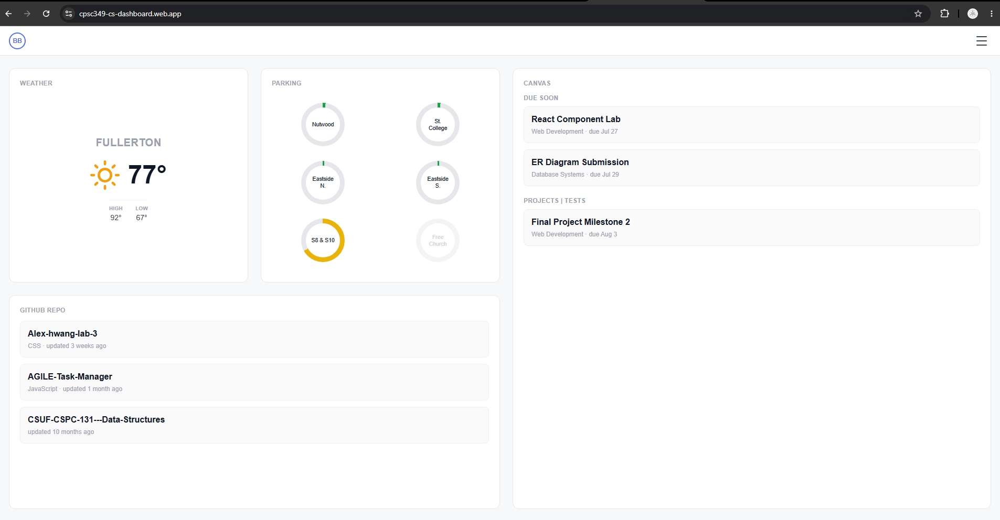
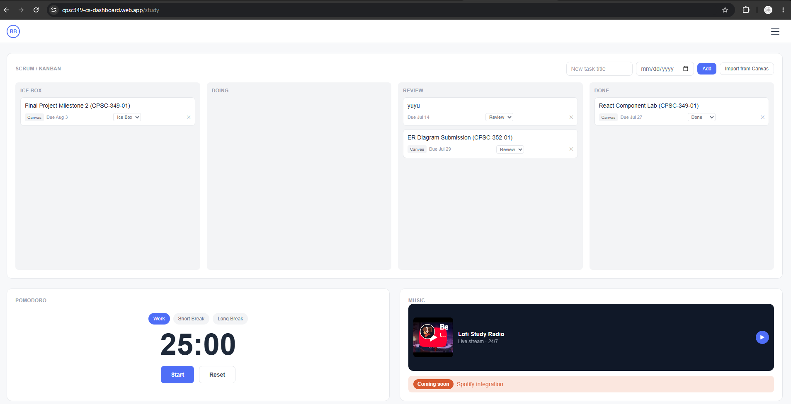
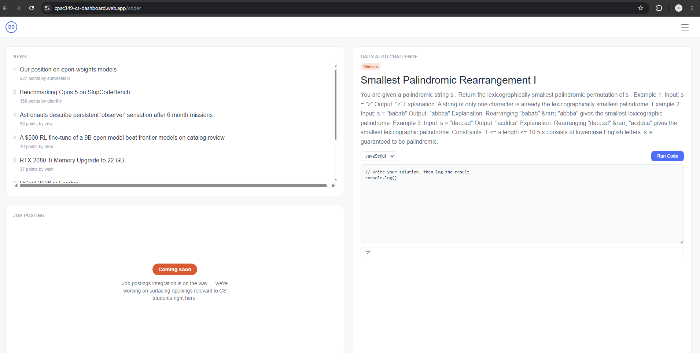
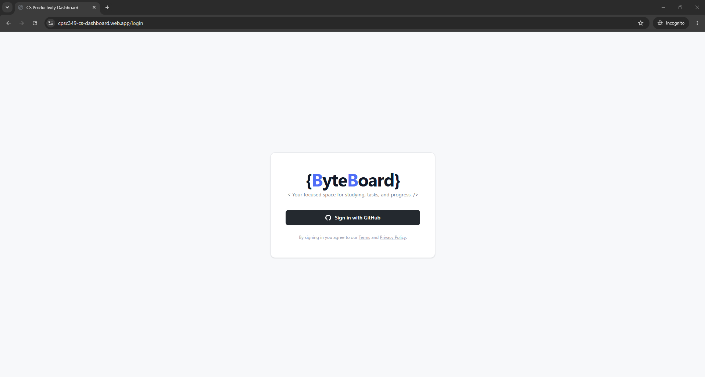

# cs-dashboard

A personalized dashboard for CS students — weather, campus parking, GitHub activity, Canvas assignments, a Study workspace (Kanban board, Pomodoro timer, music player), and a Coder workspace (tech news, a daily algorithm challenge with a live code runner).

**Team:** Jordan Querubin, Alex Hwang

**Live site:** https://cpsc349-cs-dashboard.web.app

## Features

### Home
- Live weather for your saved city (Open-Meteo)
- Campus parking availability, scraped on a schedule and cached in Firestore
- Your GitHub repositories, fetched via an authenticated Cloud Function
- Upcoming Canvas assignments



### Study
- Kanban board (Ice Box / Doing / Review / Done) with add, move, and delete
- Tasks sync live to Firestore per user, so the board persists across sessions and devices
- One-click import of Canvas assignments straight onto the board
- Pomodoro timer (Work / Short Break / Long Break)
- Lofi music player



### Coder
- Live tech news feed (Hacker News)
- Daily algorithm challenge (LeetCode community API, with a mocked fallback if it's unavailable)
- Run your own solution in-browser (JavaScript, Python, Java, C++, Go, or Ruby) via a free public code-execution API, with optional expected-output grading
- Job postings integration (coming soon)



### Auth & personalization
- Sign in with GitHub (Firebase Authentication)
- Per-user profile and preferences (e.g. city for weather) stored in Firestore
- Onboarding flow for first-time setup



## Routes

| Path | Description |
|---|---|
| `/` | Home dashboard |
| `/study` | Kanban board, Pomodoro, music |
| `/coder` | Tech news, daily algo challenge |
| `/settings` | User settings |
| `/about` | About page |
| `/login` | GitHub sign-in |
| `/onboarding` | First-time setup |

## Frontend stack

- React + Vite
- React Router
- Tailwind CSS
- Firebase (Authentication, Firestore, Cloud Functions)

## APIs used

| API | Type | Used for |
|---|---|---|
| GitHub REST API | Private (OAuth) | Fetching the signed-in user's repositories |
| Open-Meteo | Public (keyless) | Geocoding + weather forecast for the Home page |
| Hacker News API | Public (keyless) | Tech news feed on the Coder page |
| LeetCode community API | Public (keyless, with mock fallback) | Daily algorithm challenge |
| Wandbox | Public (keyless) | Running user-submitted code on the Coder page |
| Canvas LMS | Mocked via a Cloud Function fixture | Importable assignments/tasks |
| Campus parking | Scraped via a scheduled Cloud Function, cached in Firestore | Parking availability card |

## Setup instructions

### Prerequisites
- Node.js 18+
- A Firebase project (Authentication with GitHub provider enabled, Firestore, and Cloud Functions)

### Frontend
```bash
cd frontend
npm install
```

Create `frontend/.env` with your Firebase web app config:
```
VITE_FIREBASE_API_KEY=
VITE_FIREBASE_AUTH_DOMAIN=
VITE_FIREBASE_PROJECT_ID=
VITE_FIREBASE_STORAGE_BUCKET=
VITE_FIREBASE_MESSAGING_SENDER_ID=
VITE_FIREBASE_APP_ID=
```

Run the dev server:
```bash
npm run dev
```

### Cloud Functions
```bash
cd functions
npm install
firebase emulators:start --only functions,firestore
```

### Deploying
```bash
cd frontend && npm run build
firebase deploy
```

## Screenshots

See inline screenshots in the [Features](#features) section above, and the deployed site below.


